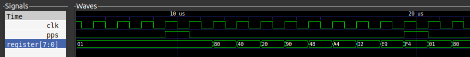

# Synchronizing a 1-PPS Signal with our PRN

Now that we know how to generate a [pseudo-random noise](../PRN/1_PRN.md), let's talk about how to use it to transfer our time and frequency information.

TWSTFT transfers frequency and time information through the use of a 1 Pulsation Per Second (1-PPS) signal. The idea behind this is that we have a very precise clock giving us a signal with a rising edge exactly every second. And we want to start modulating our carrier signal with our BPSK modulation at that precise moment. 

Basically, the goal is to restart generating our PRN everytime we receive our 1-PPS signal. So, maybe a code like this one would be enough :

```python
# 'naive' 8 bits version of a 1-PPS-synchronized LFSR
class PrnGenerator8Bits(Elaboratable):
    def __init__(self):
        # As seen before, the register, its feedback taps
        # and the I/O signals related to it
        self.register = Signal(size,reset = 1)
        self.output = Signal()
        self.input = Signal()
        self.taps = Signal(size, reset = 43) #43 is one of the 8bits m-sequence generator taps 

        # Our 1 pulse per second signal (driven from outside the class)
        self.pps = Signal()

        # A signal that we keep up when we want to generate our PRN
        self.go = Signal()
    
    def elaborate(self, platform):  
        m = Module()

        # If the 1PPS Signal is up, we start generating our PRN on the next rising edge of our clock
        with m.If(self.pps):
            m.d.sync += [
                # shifting the LFSR
                self.register.eq(Cat(self.register[1:], self.input)), 
                self.go.eq(1), #remember to keep generating PRN
            ]

        # keep generating the PRN
        with m.If(self.go):
            m.d.sync += [
                self.register.eq(Cat(self.register[1:], self.input)), 
            ]
        

        m.d.comb += [
            # updating the input and output of the LFSR
            self.input.eq((self.taps & self.register).xor()),
            self.output.eq(self.register[0])
        ]

        return m
```

Which give us the following chronogram for the simulation produced by the [PrnGenerator(naive).py](PrnGenerator(naive).py) file :



It seems fine ! The PRN (re)starts at every PPS. Though, it's not enough. 

Before the 1-PPS has been given, we don't want to modulate anything because we wouldn't be sure that we are synchronized with the exact date to emit. That's done.

But we also want to stop generating our PRN when we do not receive PPS anymore ! And that is still to accomplish. 

In order to stop the PRN at the right time, best we can do is caring about the frequency at which the PRN is generated. As the frequency unit is Hertz and the 1-PPS is repeated every second (1 Hertz ! Wow !), then we should just use a counter that counts up to our frequency every clock signal. And by the time it reaches the so-said frequency, we should receive our PPS. Otherwise, stop generating the PRN.

It's just like our program can be represented by 2 states.
Which you can describe as :
- WAITING STATE : 
    - Do nothing,
    - When PPS received, change state to GENERATING STATE, otherwise, stay in WAITING STATE.
- GENERATING STATE :
    - Update LFSR
    - Count up to the frequency value
    - When count == frequency, does PPS value equal to 1 ? 
        - yes : restart counting/generating PRN and stay in GENERATING STATE,
        - no : go back to WAITING STATE

The way we described the algorithm has a very precise name, it's a Finite State Machine (FSM). And the good thing about FSM is that Amaranth lets us write algorithms this way very easily, so let's jump into it :

```python
#second 8 bits version of the synchronized LFSR with use of a FSM
class SyncPrnGenerator(Elaboratable):

	def __init__(self): 

		self.reg = Signal(8,reset = 1)
		self.pps = Signal() # Signal on which to (re)start generating a PRN
		self.output = Signal() # Output bit of the LFSR
		self.insert = Signal() # Inpout bit of the LFSR (computed with the LFSR and the taps)
        self.taps = Signal(8,reset=43)
		
		# remaining amount of clock signal to keep generating PRN before stopping 
		# (we should also reset it every time we receive a pps)
		self.count = Signal(32 ,reset=freqout-1) 
	
	def elaborate(self, platform):
		m = Module()

		m.d.comb += [
			self.insert.eq((self.taps & self.reg).xor()),
			self.output.eq(self.reg[0]),
		]

		with m.FSM():
			with m.State("WAIT"):
				with m.If(self.pps):
					m.next = "GENERATE"
				 
			with m.State("GENERATE"):
				m.d.sync += [
					self.reg.eq(Cat(self.reg[1:],self.insert)),
					self.count.eq(self.count-1)
				]
				with m.If(self.count == 0):
					m.d.sync+=[
						self.count.eq(self.count.reset),
						self.reg.eq(self.reg.reset)
					]
					with m.If(self.pps != 1):
						m.next = "WAIT"
		return m
```
GREAT ! But still not enough. In radiology, it is rare that the default frequency of our FPGA board is exactly the one we want to use for our modulation. So we want to simulate the use of a slower clock... In other words, we need a _Prescaler_.

Maybe you know how to make one IRL, but you can also find an [amaranth software version of one](Prescaler.py) in this folder.

To align the behavour of our FSM to the frequency of our prescaler, we will just put the rules added to the synchronous domain inside a ```m.If(prescaler.output):``` and care that we now count up to the frequency of the prescaler and not to the original frequency.

The kind of amaranth program we expect should now look like [this](PrnGenerator(final).py). And now, we should be alright !


Next step : [Carrier signal generation](../Carrier/3_Clk_Generation.md)