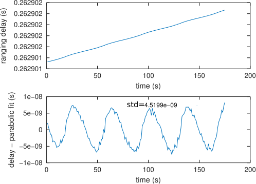

Emission from Besancon towards Telstar11N broadcast back over Europe. The
returned signal was recorded by OP in Paris. The SATRE ranging measurement
results were provided by Eric Meyer at Time & Frequency Laboratory Besancon (LTFB)
as found in the ``SATREranging`` file.

Each 3-minute record was collected odd hours at 15 and 45 minutes. Both transmission
(splitted to B210 SDR receiver reference channel) and reception (from downconverter 
recorded on the B210 receiver measurement channel) were recorded with the same clock
reference feeding the AD9364 frontend (10 MHz hydrogen maser reference multiplied
to 40 MHz FPGA clock signal by the internal PLL). Each ``.mat`` file includes all the
cross-correlation peaks between the transmitted 22-bit long (truncated to 2.5 Mchips) 
code and the received signal. The parabolic fit of the correlation peak is recorded
both in delay-value and correlation-value for further correction if possible. In the
following figure, dots are SATRE modem ranging measurements during even hours and
circles are SDR ranging measurements.

Interstingly enough the frequency correction between the uplink and downlink varies
over timer, emphasizing that the carrier offset cannot be used for time & frequency
transfer but only the code and the resulting correlation peaks are usable:

The issue under investigation is the impact of the satellite motion during the
correlation peak energy accumulation: the periodic fluctuation on the correlation
peak maximum matches the rate at which the satellite is moving (dip to dip delay
matches the correlation peak shifting by 200 ns or the sampling period). Cancelling
this effect is under investigation, and might be related to the length (1 s) of
the selected code ... to be continued. This asymetric correlation impact on the
parabolic correlation fit accuracy was possibly described in [1]

[1] J.-M Friedt, C. Droit, G. Martin, and S. Ballandras,
A wireless interrogation system exploiting narrowband acoustic resonator for remote physical quantity measurement
Rev. Sci. Instrum. vol. 81, 014701 (2010) 
