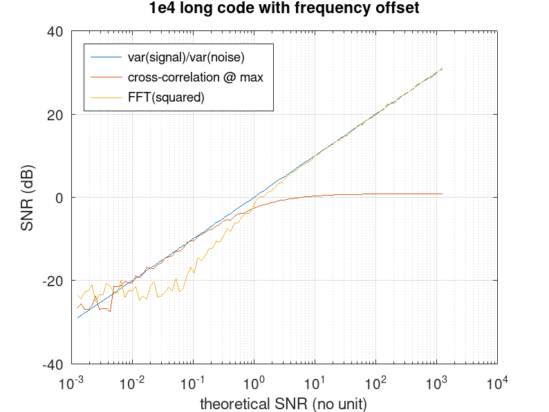

# Computing the Signal to Noise ratio

The signal to noise ration is defined as the power in the signal to the power
in the noise, classically computed as var(signal)/var(noise).

In the TWSTFT link we only receive a signal x=signal+noise with signal a noise
pseudo-random sequence. Hence the objective in estimating SNR is to extract
the signal from x and compute var(signal)/var(noise).

Our initial investigations at finding the solution to extracting the signal 
from x involved either squaring the signal to get the unspread carrier by
cancelling the BPSK modulation, or correlating x with the code and considering
that the cross-correlation peak would hold the signal and any other delay
the noise. These solutions are plotted for reference but do not work:
* at low SNR on the squared FFT of a signal with no frequency offset, the DC 
offset (positive from squaring the signal) hides the signal and the SNR estimate 
remains constant instead of decreasing
* at low SNR with a frequency offset, the estimate properly decreases but
somehow diverges, probably due to the increased noise from squaring x
* the correlation works fine at low SNR but remains constant at high signal.
Claudio Calosso (INRIM) identified the self-noise of the pseudo-random code
sequence autocorrelation as the cause of hiding the noise: when the SNR becomes
too high, the code noise away from its autocorrelation maximum rises above
the additive noise which can no longer be seen.

[This simulation code](simu_snr.m) demonstrates these concepts.

Claudio Calosso (INRIM) provides the solution by stating that the signal
is extracted from x at the known time delay identified by the cross-correlation
between x and the code by multiplying the time-shifted x with the code. Doing
so cancels the spectrum spreading from the carrier binary phase shift
keying, resuling in a mean value whose square is the signal power, and 
a variance representative of the noise power. Indeed 
[this simulation code](interpolation_effect.m) demonstrates how code interpolation
and iFFT interpolation do not affect the SNR using this processing technique,
matching the theoretical SNR known from the synthetic signals since the
code and noise are separately known before being added.

Finally once the SNR has been identitified, the C/N0 result is computed by
multiplying with the receiver bandwidth. With our SDR, the 5 MHz sampling rate
adds 67 dB to the estimated SNR. From the channel received from the satellite
link downconverter, we extract about -10 dB SNR so that the C/N0 is estimated
as 57 dB.Hz.
