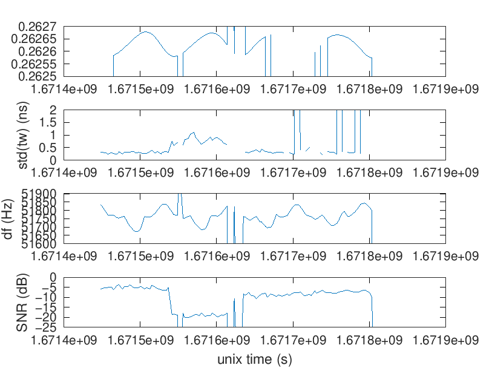
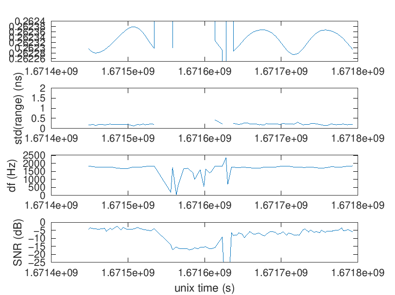
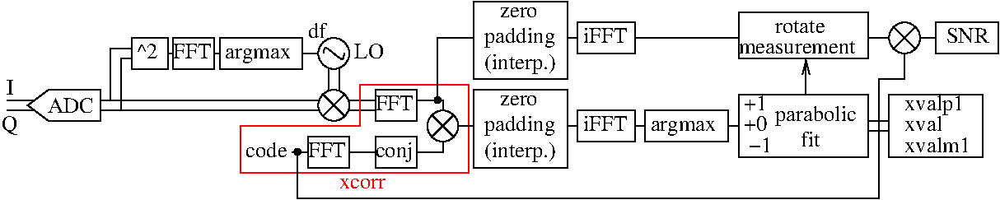

# Results

The binary files streamed from the SDR were stored first in RAMdisk and then 
processed using godual_ranging.m and godual_ranging_remote.m (same script except
for the remote flag but allowing to run automatically the two processing sequence
in parallel from a crontab). The resulting Matlab files holding the relevant 
cross-correlation processing variables are kept for post-analysis using
verif.m (one for LTFB and one for OP since the naming conventions are different,
with the former prefixing the TwoWay analysis with remote and the latter using
a different sub-directory name). Below the result of post-analysis:

* ranging from LTFB


* OP two-way seen from LTFB.



* ranging from OP



Notice the signal drop from OP at the middle of the session due to a damaged 
buffer. The SNR measurement at OP and LTFB confirms the power drop by 15 dB 
also observed on the emitter monitoring power probe. OP ranging standard deviation
is in the 200 ps range integrated over 2 minutes, LTFB exhibits some local
fluctuations in the ns range in the beginning and then settles to 200 ps standard
deviation as well. The frequency shift introduced by the satellite transponder
is consistent with 200 Hz fluctuations overs 5 days. The power emitted from LTFB
remained constant and so did its SNR measurement. The OP drop of SNR by 15 dB is
matched with a rise of its ranging standard deviation to about 1 ns.

# C++ application

Compiled with ``make`` if host and target are the same (e.g. x86 PC) or
``make FFTW_THREADS=0`` for single-threaded application (default), or
``make FFTW_THREADS=1`` for activating multi-threading.

For cross-compiling to the RPi4, assuming Buildroot is located in ``$BR``:
```
make BR_DIR=$BR CROSS_COMPILE=aarch64-linux-
```
which expects FFTW3 with double precision to be active in BR (as well as matio and libz).

The application expects two arguments, respectively the data file (interleaved complex
short integers) and the code sequence (unsigned 8-bit integers).

# Algorithm

The processing sequence is summarized as follows:


