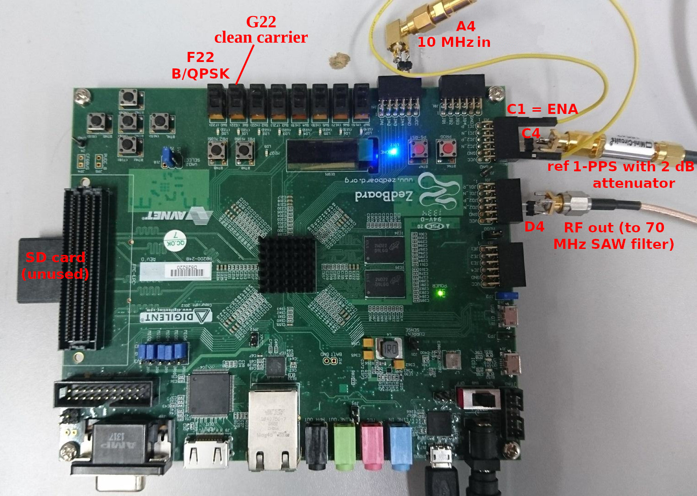

# Installation guide for Amaranth and cie

This project will be using the [Amaranth](https://amaranth-lang.org/docs/amaranth/latest/) framework for describing the hardware configuration of
an FPGA. Amaranth requires multiple dependencies to be installed before running, as described below. Each software has its own dependencies: please 
refer to their respective README.md on their github repository for the list of packages to be installed on your GNU/Linux distribution.

### git :
Git is a version control manager that provides a lot of tools to
- track changes brought to your files and allow to come back to another version of things you are programing,
- mutualize code and files with collaborators, 
- help solving conflicts between different versions of the same file that you would want to merge
- and much more...
Most of the things you'll need are just github repositories that you can clone. 
You may already be familiar with git and github, but if you're not, the first step is to install [git](https://git-scm.com/book/en/v2/Getting-Started-Installing-Git). 
Moreover, knowing how to use git for your projects can be a big advantage. So also feel free to [learn more](https://git-scm.com/book/en/v2/Getting-Started-About-Version-Control) about this software. 
On Debian or Ubuntu GNU/Linux, ``sudo apt install git`` will install git-related commands.

### Python 3 :
Amaranth is a python package so if the interpreter is not installed, you are about to face some difficulties programming in this language.
You can follow this [installation guide](https://wiki.python.org/moin/BeginnersGuide/Download). Along with this, maybe try following one or two basic tutorials about python programming if you never used this language before.

### boost :
Boost is a C++ library which provides some general tools for the language. It will not be directly used but is a dependency of 
some of the software we are about to install.
Link to boost installation guide [here](https://www.boost.org/doc/libs/1_79_0/more/getting_started/index.html)

### pip3 :
A package manager to install easily new python packages: [check this out](https://www.activestate.com/resources/quick-reads/how-to-install-and-use-pip3/) !

### Yosys :
Yosys converts Verilog code into something an FPGA board understands. Although Verilog code will not be written, it can be interesting to know what lies under the carpet when writing python/amaranth code... Amaranth helps converting python code into Verilog, which is a widely used language for describing integrated electronic circuits. 

The following packages will be needed on Debian/GNU Linux for compiling: ``clang tcl8.3-dev libreadline-dev bison flex`` in addition to the usual build tools. (``buid-essential``).

The following commands to be executed in a terminal will install the software:

```bash
git clone https://github.com/YosysHQ/yosys.git
cd yosys
make -j$(nproc)
sudo make install
```

### Icestorm :
Icestorm is needed when working with ICE40 FPGA boards as they contain special elements that are not included in standard yosys implementation.

```bash
git clone https://github.com/cliffordwolf/icestorm.git
cd icestorm
make -j$(nproc)
sudo make install
```

### nextpnr :

Nexpnr maps gates, flip-flops, memories and associated components on the field programmabable gate array resources in order to run the
programmed algorithm.

```bash
git clone https://github.com/YosysHQ/nextpnr
cd nextpnr
git submodule update --init --recursive
cmake -DARCH=ice40 -DUSE_OPENMP=ON
make -j$(nproc)
sudo make install
```

### Amaranth :

The python package that we are going to use and abuse to work on our FPGA boards and implement.
There are two git repositories to clone : one for the programming tools, and one for the possibility to flash our programs on different kinds of boards.

```bash
git clone https://github.com/amaranth-lang/amaranth
cd amaranth
pip3 install --user -e . --break-system-packages

git clone https://github.com/amaranth-lang/amaranth-boards
cd amaranth-boards
pip3 install --user -e . --break-system-packages
```

And finally... 

### amaranth twstft

```bash
git clone https://github.com/oscimp/amaranth_twstft
cd amaranth_twstft
pip3 install --user -e . --break-system-packages
```

## And now?

Once all software and libraries are installed, you should be ready to code with amaranth! 

The current version of the TWSTFT implementation described in this documentation is implemented on a [ZebBoard](https://www.avnet.com/wps/portal/us/products/avnet-boards/avnet-board-families/zedboard/). Transfering the gateware to the board through the virtual JTAG link using the microB USB connector is achieved thanks the [OpenFPGALoader](https://trabucayre.github.io/openFPGALoader/guide/install.html). Make sure to install the proper udev rules to access the low-level USB functionalities needed to communicate with the board.

For accessing the PL part of the Zynq withough relying on an SD card including the bootloader, select
the appropriate switch configuration as descrinbed in section 2.10.1 of [the Zedboard manual](https://digilent.com/reference/_media/zedboard:zedboard_ug.pdf) reproduced here:


The ``amaranth_twstft/flashZedBoard.py`` script should help you configure, synthesize and transfer the program to the board. The script will accept arguments including the PRN length, PRN register size, seed value, modulation scheme or dumping the PRN in a binary file as decribed with  the ``--help`` argument. The basic usage is
```bash
./amaranth_twstft/flashZedBoard.py --bitlen 22 --noiselen 2500000
```
for a 22-bit long shift register, 2.5 MS long code

The pinout for testing the setup is shown below, with the 2 dB attenuator on the 1-PPS
inserted to reduce the TTL-level (0-5 V) signal to something like 0-3.3 V compatible
with the FPGA. The ENAble signal is raised to Vcc to run the pseudo-random sequence generated
on the radiofrequency output with BPSK or QPSK (depending on the switch status) modulation
of the 70 MHz carrier.



Next step : [Usage](01_usage.md)
