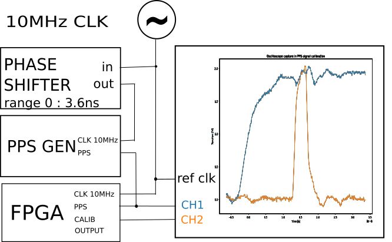
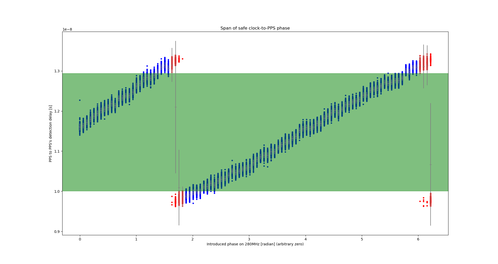
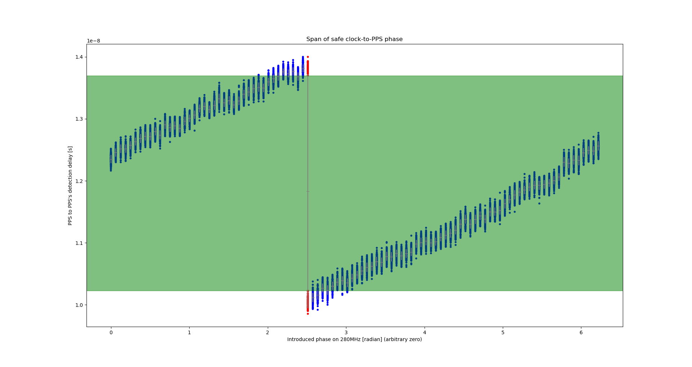
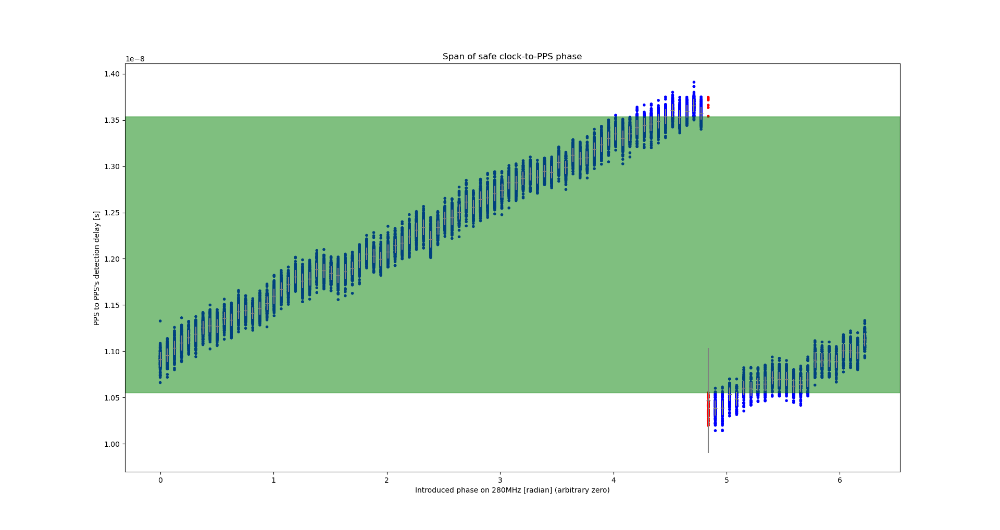

# CMOD A7 integration
Back to the [README](../README.md)
Previous step : [Installation of Amaranth and cie](00_Installation.md)

This section details how to flash the gateware and how to configure the FPGA via UART serial.

## Bitstream generation

```
usage: flashZedBoard.py [-h] [--platform PLATFORM] [--bitlen BITLEN] [--noiselen NOISELEN] [-m MODFREQ] [-p] [-v]
                        [--no-build] [--no-load] [--flash] [--build-dir BUILD_DIR] [--conv-to-bin]
                        [--toolchain TOOLCHAIN]

options:
  -h, --help            show this help message and exit
  --platform PLATFORM   Target Platform (CMOD A7 only for now)
  --bitlen BITLEN       number of bits of the LFSR
  --noiselen NOISELEN   length of the PRN sequence
  -m MODFREQ, --modfreq MODFREQ
                        frequency of the PSK modulation (Hertz) (default :2.5e6)
  -v, --verbose         prints all the parameters used for this instance of the program
  --no-build            sources generate only
  --no-load             don't load bitstream
  --flash               write bitstream into SPI flash (CMOD A7 only)
  --build-dir BUILD_DIR
                        build directory
  --conv-to-bin         convert .bit file to .bit.bin
  --toolchain TOOLCHAIN
                        toolchain to use (Vivado or Symbiflow) (CMOD A7 only) (default: Vivado)
```


Required options:
- `BITLEN` is the *PRN* shift register size ([Pseudo-Random Noise generation](02_PRN.md)) (default: 17)
- `NOISELEN` is the number of bits produces before reseting the *PRN* shift register (default: 100000)

Optional options:
- `--no-build` limit to amaranth -> *Verilog* convert
- `--no-load` bypass load step after bitstream
- `--flash` write the bitstream in non-volatile memory, by default, the bitstream is written to volatile memory.

for example:
```
./amaranth_twstft/flashZedBoard.py --bitlen 17 --noiselen 100000
```

**CMOD A7 only**: by default *Vivado* is used to produces the bitstream, but it's
also possible to use the *f4pga* Open-Source toolchain.

## Configuration

At runtime, the FPGA can be configured with the `twstft_config.py` script.

```
usage: twstft_config.py [-h] [-d DEVICE] [-b BAUDRATE] [-l BITLEN] [-m] [--list] [-p] [-ta TAPS_A] [-tb TAPS_B]
                        [--prn N] [-t] [-M {OFF,CARRIER,BPSK,QPSK}] [-T {OFF,INVERT_FIRST_CODE,TIMECODE}]
                        [-C {OFF,CLK,PPS}]

options:
  -h, --help            show this help message and exit
  -d DEVICE, --device DEVICE
  -b BAUDRATE, --baudrate BAUDRATE
                        serial baudrate
  -l BITLEN, --bitlen BITLEN
                        the bitlen of the FPGA's LFSR. Hardwired in FPGA's gateware, this option doesn't modify it's
                        config but is required to communicate properly the taps settings
  -m, --monitor         keep listening and print debug signals to stdout
  --list                list available devices
  -p, --pps             when monitoring, also print debug signal for valid and expected PPS
  -ta TAPS_A, --taps-a TAPS_A
                        set taps for LFSR A (BPSK & QPSK)
  -tb TAPS_B, --taps-b TAPS_B
                        set taps for LFSR B (QPSK only)
  --prn NOISELEN        save a PRN of N bits generated by given taps
  -t, --set-time        set FPGA's time to computer's time
  -M {OFF,CARRIER,BPSK,QPSK}, --mode {OFF,CARRIER,BPSK,QPSK}
                        turn OFF / set modulation mode
  -T {OFF,INVERT_FIRST_CODE,TIMECODE}, --time-mode {OFF,INVERT_FIRST_CODE,TIMECODE}
                        set timecode mode
  -C {OFF,CLK,PPS}, --calib-mode {OFF,CLK,PPS}
                        set calibration mode
```

### Connecting to the device

`./twstft_config.py --list` will list available serial ports.
`DEVICE` must be set to the one connected to the FPGA.

### Setting taps and generating PRN

The taps of both LFSR can be set independently with:
```
./twstft_config.py -d DEVICE -l BITLEN -t{a|b} TAPS
```
Where `BITLEN` is the size of the LFSR, and the same as the `BITLEN` specified at bitstream generation.

To save the generated PRN to disk:
```
./twstft_config --prn NOISELEN -l BITLEN -ta TAPS_A [-tb TAPS_B]
```
If both taps are specified, the two prn are interlaced bit by bit.

Options are fully compatible, and can be passed in one command :
```
./twstft_config.py -d /dev/ttyUSB1 -l 17 -ta 9 -tb 15 --prn 100000
```
Will set the LFSR taps on the FPGA to 9 and 15, and save both 100000 bits PRN interlaced in a 200K file (1 bit per byte).

**Note**: setting LFSR's taps to zero disable it. At reset, both taps are set to zero.

### Enable and configure antenna output

The modulation scheme can be set with:
```
./twstft_config.py -d DEVICE -M MODE
```

Where `MODE` can be:
 - `OFF` disable antenna output and output a constant low signal.
 - `CARRIER` output clean 70MHz carrier.
 - `BPSK` output BPSK modulated by LFSR A
 - `QPSK` output QPSK modulated orthogonally by LFSRs A and B

**Note**: At reset, mode is set to `OFF`.

### Enable timecode

This option allows to encode the second start or even the seconds of the minute in the phases of PRNs.
It is set with:
```
./twstft_config.py -d DEVICE -T MODE
```

Where `MODE` can be:
 - `OFF` disable time encoding
 - `INVERT_FIRST_CODE` at each PPS, the phase of the first PRN is flipped, allowing time comparison between clocks with more than a PRN's length in offset, as long as the offset is less than half a second.
 - `TIMECODE` at each PPS, the phase of the first PRN is flipped, and the phases of the 6 following PRNs encode the seconds of the minute from 0 to 59. Allowing time comparison between clocks with as much as 30 seconds offset.

**Note**: At reset, timecode is disabled.

When using `TIMECODE`, to set the FPGA's seconds counter, use `--set-time` to set the FPGA's time to computer's time.

### Calibration output

Option `-C` sets the output off the calibration pin. It's usage is described in the next section. During normal use, this setting should be set to `OFF`.

**Note**: At reset, this is set to `OFF`.

### Monitoring

When receiving a PPS, the FPGA starts a timer that takes one second to finish. When an unexpected PPS is received, a warning is send via UART to the computer.
To monitor these warnings, use option `-m`. To also get messages when the PPS arrives at the right time, add `--pps`.

All option, are compatibles, when using `-m`, all config modifications are performed before the monitoring begins.
It is also possible to modify config while another instance of the script is monitoring, but beware that the monitoring will crash if another instance tries to read from the serial port.

## Calibration

On certain phase conditions between the input PPS and the input 10MHz clock,
a small jitter can be enough for the PPS to be detected in one tick or another in the 280Hz clock domain.
In order to avoid these conditions, it may be necessary to phase shift the input PPS to ensure that it will always be detected during the same tick.

### Finding the safe phase conditions

To find the safe phase conditions, we need a way to phase shift the PPS signal by a whole 280MHz phase (~3.6ns) and an oscilloscope to monitor the effect of the phase shift.

To automate the search for a safe phase span, we used an Agilent 33220A arbitrary waveform generator to phase shift the 10MHz clock ticking the PPS generator, and a Rohde & Schwarz RTO2034 oscilloscope triggered at the rising edge of the input PPS looking for the rising edge of the detected PPS.
To output the detected PPS on the FPGA's calibration pin, use the command :
```
./twstft_config.py -d DEVICE -C PPS
```

Setup for PPS calibration :


For the CMOD A7 board, we performed 3 phase-sweeps, each with a 36ps step and 200 acquisitions per step,
once without emitting on the antenna pin, once emitting a clean carrier and once emitting a BPSK modulated signal.
These two acquisitions are to ensure that cross-wire interference from the antenna pin doesn't affect PPS detection.

Results with antenna output off:


Results with antenna output emitting a clean carrier:


Results with antenna output emitting a BPSK modulated signal:


For the CMOD A7 board, we find that a 12ns delay between the rising edges at a 1V threshold, is safe.

**Note**: the calibration pin has a notch filter set at 70MHz in order to cancel cross-wire interference from the antenna.

**Note**: when setting up a TWSTFT station with a CMOD A7 board, it is not necessary to replicate these acquisitions.
Only to ensure that the measured delay between the rising edges at a 1V threshold is in the green span of the above diagrams.
When we will support other FPGA boards, we will add the safe spans for each of them.

## Pin functions


| function              | dir | <a href="https://digilent.com/reference/programmable-logic/cmod-a7/reference-manual">CMOD A7</a> |
|-----------------------|-----|--------|
| 10MHz in              | in  | GPIO46 |
| PPS in                | in  | GPIO42 |
| calibration           | out | GPIO36 |
| output                | out | GPIO31 |
| UART-i                | in  | micro-USB |
| UART-o                | out | micro-USB |

Next step : [Pseudo-Random Noise generation](02_PRN.md)
