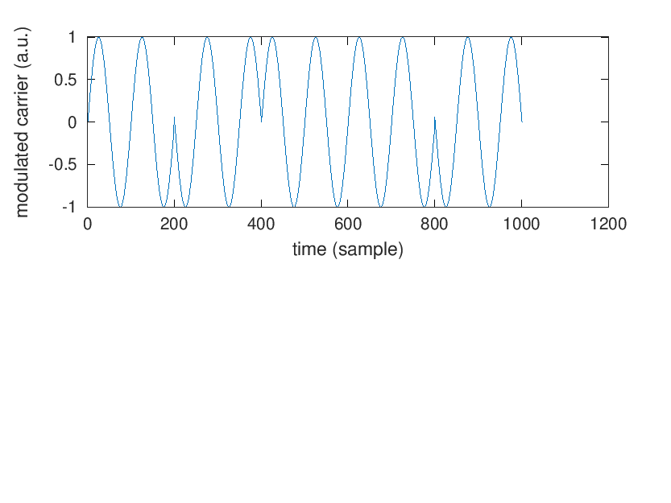
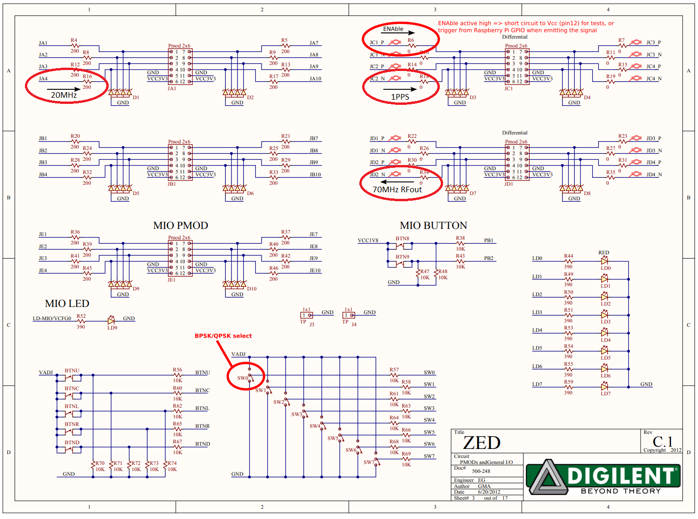

# Mixing our Carrier Signal with the 1-PPS Signal
Back to the [README](../README.md)
Previous step : [Generating the appropriate clock signal](04_Carrier_Generation.md)

Good news : We are almost done with our BPSK emission !

But how do we actually modulate our carrier signal ? Well, now that we are talking about it, there are two possibilities :
- modulating it physically through the use of a mixer,
- modulating it electronically with FPGA programmation.

Here, we'll focus on the second method.

We have two signals : one to be modulated, and one to modulate with. From an  amaranth programming point of view, these signals can just take two values, zero and one. And the advantage of such signals is that they can easily be phase shifted. Indeed, to apply a 180° phase shift, you only need to negate the value of the signal. So everytime the PRN value goes from one to zero and vice versa, we will reverse the bits of our carrier signal. How to do it ? With an `exclusive or`. 
|carrier|prn|modulation (carrier ^ modulation)|
|:-------:|:---:|:---------------------------------:|
|0|0|0|
|1|0|1|
|0|1|1|
|1|1|0|

The truth table of such operation shows that the phase shift would nicely happen only when the prn value is one.

```python
def elaborate(self, platform):
	m = Module()
	# In this example and the following one, 
	# we'll assume we have at disposal 
	# the carrier signal,
	carrier = Signal()
	# the 1-PPS Signal and the 
	# Synchronizer module we decribed in the previous 
	# sections of this documentation
	pps_i = Signal()
	output = Signal()
	prn = Synchronizer(self.freqin, self.freqout)
	m.d.comb += prn.pps.eq(pps_i)
	
	# Mixing operation
	m.d.sync += output.eq(prn.output ^ carrier)
```

Are we done yet ? Sorry but not really...
To ensure that the signal can correctly be demodulated, we should care about the moment when the modulation is applied. We want the carrier signal to be phase-shifted only when it goes throug a zero value. This allows to keep the signal consistent. 



To make sure the phase transition happens at the moment the sinusoid goes by zero, we are going to use the same trick as the one for the 1-PPS detection, but this time, we are not only going to focus on the rising edge but also on the falling edge. (This sort of operation is only required if you are working with a carrier signal that may not be phase aligned with your clock signal. So if you generate your carrier in the same way as described in the previous section, it won't be usefull.)


```python
old_carrier = Signal()
zero = Signal()

m.d.sync += old_carrier.eq(carrier)
m.d.comb += zero.eq(old_carrier ^ carrier),

with m.If(zero):
	m.d.sync += output.eq(prn.output ^ carrier)
```

And now we should be done for the modulation ! An example of a [Mixer program](../Mixer.py) is available in this directory. The last step is to choose on which pin to send the modulated signal, but we won't talk about it here as it depends a lot on the FPGA board you are using.

Connecting the signals to run the design is achieved by using the three
signals described below, namely the input reference 20 MHz clock, input 1-PPS 
and the output 70 MHz BPSK or QPSK modulated with the PRN sequence. The
20 MHz can be generated by using a frequency doubler followed by a comparator
to provide the 0-3.3V square output needed to clock the FPGA.



If you intend going further, you may want to see how to implement [QPSK modulation](./06_another_modulation.md).
