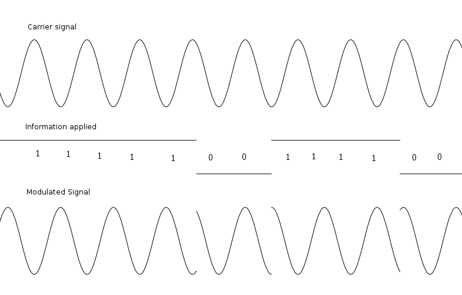
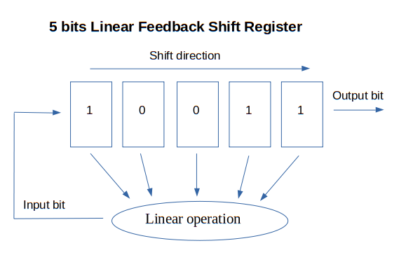
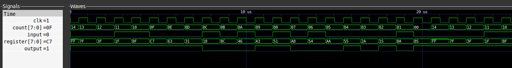

# Pseudo-Random Noise Generation
Back to the [README](../README.md)
Previous step : [Installation of Amaranth and cie](0_Installation.md)

It's no surprise that the use electromagnetic waves is required if we want to use satellite communication. however, the nature of the information we share makes it not so easy to transmit. We want to share a frequency information. Which is basically just a signal that's repeated over and over again. But the fact that this information is being repeated AND carried by a periodic signal is complicating the task. It's as if we were to diferenciate a sinusoid to another one with a 2pi phase shift. In such case, how to make the difference between our 1-PPS signal and the same signal a few milliseconds later ?

Which solution can we bring to this problem ? __Binary Phase Shift Keying__ (BPSK) modulation. 

This kind of modulation allows us to transmit binary informations through the phase of our carrier signal. Whenever a 0 turns into a 1 (and vice-versa), the modulation applies a pi phase shift.

In fact, there are many more different types of modulations we could apply. Just like for radio communication, we could use AM or FM modulation, however, these kinds of modulation do not allow us to be as precise as we would like to be. So BPSK is just fine.



We want to use this method to create a 1-PPS signal. So we need to make sure that the information carried does not repeat itself. This way, the auto-correlation of the signal gives us a one when the phase shift is 0 and a close-from-zero value otherwise. Which implies that we are able to differenciate the begining of the signal and subsequently, distinguish our 1-PPS within the received signal with a precision directly proportional to the length of the not repeated information transmitted. As such information, we will use a __Pseudo-Random Noise__ (PRN), a bit sequence with a veeery long period (more details later in this page).

## Linear Feedback Shift Register

A common way to generate a PRN sequence at a very high rate is to use a Linear Feedback Shift Register (LFSR). 
It consists in a certain amount of Flip-Flops which contain 1 bit each. Every time the clock signal associated to the register is triggered, each FF gives its value to the following one. The last bit is used as the output of the register and the first bit is retrieved by a linear operation on the different bits of the current state of the LFSR.



The _linear operation_ in the figure above consists in a bunch of xor doors.

The current binary value stored in the LFSR is called the _state_. The initial tstate is called the _seed_ and the places where we put the xor doors are called _taps_. The bit sequence produced depends on the _seed_ and the _taps_.

As the operation doesn't change along the processing, and as the register has a finite number of different states (2^n for an n bits register), the LFSR has to produce a periodical bit sequence. So if we want to generate a certain PRN, we first need to make sure that the period of the sequence is long enough. 

There are mathematical proofs that well defined taps for an n bits LFSR lead to a sequence of maximum length 2^n-1 (m-sequences) and we want to use these taps to generate our PRN. To ensure the PRN is long enough, we also choose a resonable bit length for the LFSR. 

So now, let's implement this !

In a first time, we'll just code an 8-bits LFSR with amaranth. 

```python
from amaranth import *

class LFSR_8(Elaboratable):
    def __init__(self, seed,taps):

        # Here is our register
        self.register = Signal(8,reset = seed) 

        # The output of our LFSR
        self.output = Signal()

        

        # The binary value that represents 
        # which bits to use for our xor operation.
        # A value of 0x0B means the input will be 
        # bit_0 ^ bit_1 ^ bit_3
        self.taps = Signal(8, reset = taps)
    
    def elaborate(self, platform):  
        m = Module()

        # The result of the linear operation 
        # on the bits of the LFSR
        insert = Signal() 
        
        # Whenever the clock signal of the PRN generator is at high,
        # we update the register
        m.d.sync += [
            #appending the input to our shifted register
            self.register.eq(Cat(self.register[1:], insert)), 
        ]

        # When the sequence is long enough, we restart
        
        m.d.comb += [
            # Accomplishing the linear combination of the bits defined by the taps
            insert.eq((self.taps & self.register).xor()),
            # updating the output of the LFSR
            self.output.eq(self.register[0])
        ]

        return m
```

A quite different version is given as example [here](../prn.py). This one is much more flexible as it allows to enable and disable the signal emission through the use of an input signal, it also works with LFSR of any bit length. Maybe this version is too advanced for the moment but it will be more detailed in the next chapter of this documentation. Though, it computes the exact same sequence. Its script allows us to simulate this program's execution on a FPGA board. 

The parameters used here are :
    seed = 0xFF
    taps = 0x2D
    bit_length = 8 



As you can see (and as expected), the state of the register is shifted right on every clock rising edge and it seems that the value inserted depends on the current state. 

Alright ! So now that we have a shift register, let's talk about the taps to use.

After doing some research on the subject, it appears that our taps on a n-bits LFSR are some sort of physical representation of polynomials of degree n with coefficients in GF(2) (ie: 0 and 1).

So every n-bits LFSR can be characterized by a polynomial. In the previous example, the polynomial associated to our taps positions (0x2D or 0b00101101) is :

x^8 + x^5 + x^3 + x^2 + 1

or, more explicitly :

1*x^8 + 0*x^7 + 0*x^6 + 1*x^5 + 0*x^4 + 1*x^3 + 1*x^2 + 0*x^1 + 1*x^0

And the interesting thing about this is that each LFSR which representative polynomial is a __primitive polynomial__ are generating m-sequences. (More about primitive polynomials and LFSR [here](http://www-math.ucdenver.edu/~wcherowi/courses/m5410/m5410fsr.html), [here](https://www.gaussianwaves.com/2018/09/maximum-length-sequences-m-sequences/) and [here](https://www.cs.miami.edu/home/burt/learning/Csc609.022/random_numbers.html).

Well, good ! Then we just need to find such polynomials to choose our taps ! But that's easier said than done because we need to prove for every polynomial we find that it is irreducible. And that's a task mathematicians deal with since long ago... So instead of trying to be smart (at least for the moment), we will just use brute force to determine our taps.

Actually, you can also look for LFSR tables on the web. They already give you this kind of information. BUT, we will find taps by ourself anyway because why not.

So first, we implement a LFSR in regular python :

```python

def unary_xor(x):
	"""if x == 0b0101101, returns 0^1^0^1^1^0^1"""
	res = x & 1
	for i in range(1,int.bit_length(x)):
		x=x>>1
		res ^= 1 & x
	return res

def next_state(current, taps, bit_len):
	"""returns the next state of the LFSR 
	following its size(bit_len), the taps 
	(taps) and its current state (current)"""
	bit = unary_xor(current & taps)
	res = current >> 1
	res |= bit << (bit_len-1)
	return res

```

Yes. Our LFSR is just a number to which we apply functions. In fact, that's not so different from the FPGA representation if we consider the FFs as a binary representation of a number.

So now, to see if a n-bits taps combination is generating a m-sequence, we will... generate its sequence and check if it is repeating itself before reaching the 2^n-1 state. 
In fact, we won't check every single combination of n zeros and ones because every polynomial with a non-zero constant term can be divided by X. So we'll get focused on taps represented by odd numbers.

```python
def m_seq_taps(bit_len, limit = 1):
	"""generates (limit) taps which binary value 
	represents where to put the taps on an LFSR to 
	generate a m-sequence of (bit_len) bits values"""

	taps = [] # list to store m-sequence associated taps

     # starting with the value 1 because its the only non-zero value
     # that is part of every m-sequence, whatever the bit length
	seed = 0x1
	
	# We only test odd numbers as the constant coefficient 
	# of a primitive polynomial should always be 1 
	# otherwise we could divide the polynomial by X
	taps_to_test = [2*i +1 for i in range(ceil(pow(2,bit_len-1)))]
    
	for tap in taps_to_test:
		test = seed
		
        # We check for an appeareance of a 0-state or a seed-state before the end of the m-sequence 
		for j in range((pow(2,bit_len)-2)) : 
			test = next(test, tap, bit_len)
			
            # Whatever the taps are, if the state of the LFSR is 0,
            # the input bit will always be 0 so, no need to check further. 
            # Also, if we meet again the initial state, that means the
            # period is less than 2^bit_len -1.
			if (test == seed or test == 0):
				break
			
		
		if (test != seed and test !=0):
			#print(f"sequence with taps {taps} is a m-sequence")
			taps.append(tap)

            # We prefer to set a limit to the number of taps we look for
            # because it could take some time to find all appropriate taps 
            # if bit_len is too large
			limit-=1
			if limit == 0 :
				break
	return taps
```

And to go a little further, this python script also contains a small amount of functions that manage `.pickle` files to save and re-use taps that have already been found.

And that's it ! Next step : [Synchronizing PRN with a 1-PPS signal](2_Sync_PRN_1PPS.md)
