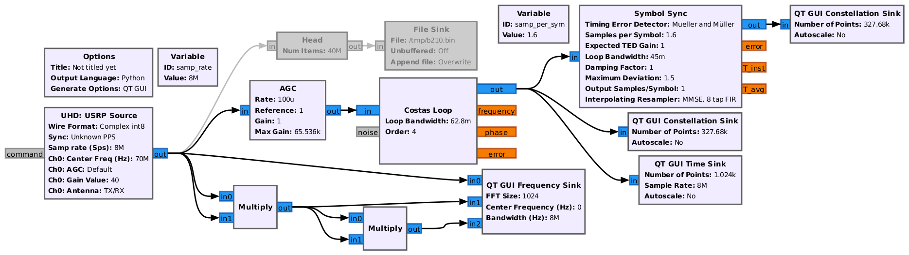
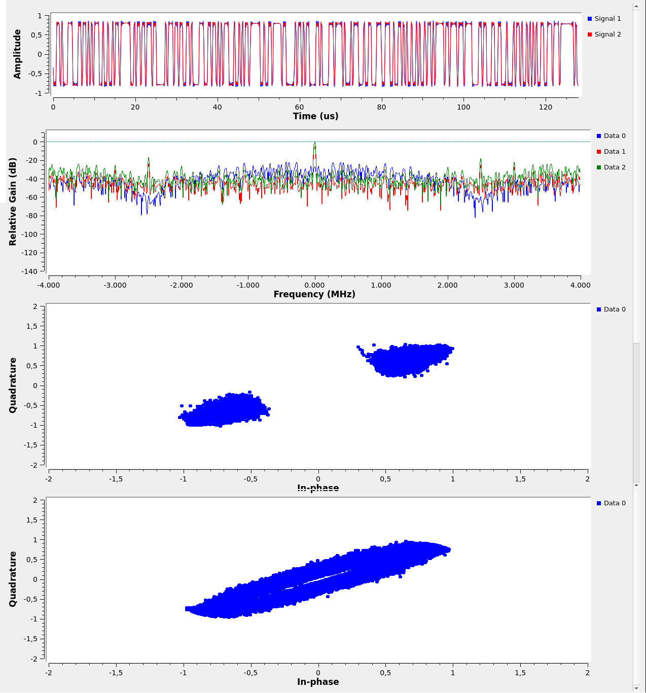
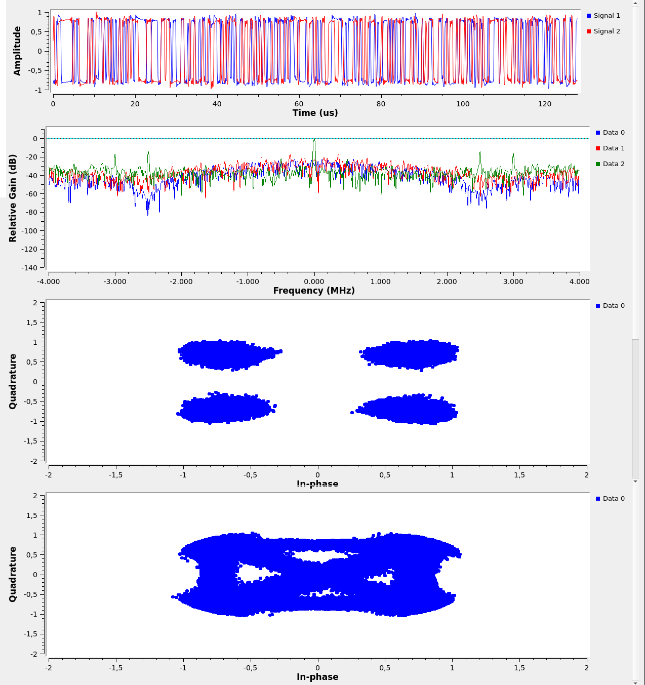

# Demodulating the N-PSK modulated signal
Back to the [README](../README.md) 
Previous step: [QPSK modulation ](5_another_modulation.md)

Phase modulation is the most efficient modulation scheme [1] but also the most 
complex to demodulate since an exact copy of the transmitted carrier must be
generated on the receiver. The classical means for cancelling the N-PSK 
phase modulation is to consider the N-th power of the received signal. Indeed,
complex baseband signal s(t)=exp(j*2pi*df*t+j*phi(t)) with df the frequency 
difference between emitter and receiver frequencies (to be cancelled for phase
demodulation) and the phase phi(t)=2*pi*k/N, k=[0:N-1], carrying the time-dependent
information, becomes after computing the N-th power: 
s^N(t)=exp(j*2*pi*N*df*t+j*N*phi(t)) and since N*pi is N*2*pi*k/N=k*2*pi=0 since 
k is an integer, we end up with a clean carrier at N*df: s^N(t)=exp(j*2*pi*N*df*t)

Either cancelling df or dividing the frequency of s^N(t) reproduces a clear copy
of the carrier and mixing with the incoming signal cancels the time varying 
argument of the trigonometric function to only yield exp(j*phi(t)). These 
operations are achieved with GNU Radio using the Costas loop whose bandwidth
is advised in the documentation to be about 2*pi/100 and whose order is the N in
N-PSK, i.e. the number of possible phase values encoding the signal. The
GNU Radio Companion flowchart is

Following the Costas loop, the Symbol Synchronization block avoids sampling the
signal on the transitions of the signal connecting stable phase values but only
samples a single phase estimate synchronized on the sharp transitions. In the 
following charts, from top to bottom are displayed the time-domain I and Q samples,
in the middle the resulting constellation plot after Costas loop and Symbol 
Synchronization with N clearly separated point clouds, and on the bottom the
output of the Costas loop prior to Symbol Synchronization with the lines linking
the point clouds.

BPSK modulation (N=2) with a Costas loop set to the second order:

BPSK modulation (N=2) with a Costas loop (erroneously) set to the fourth order:

QPSK modulation (N=4) with a Costas loop set to the fourth order:

Using GNU/Octave, the N-th power of the signal ``s`` is computed with ``s.^N``,
again leading to a clean carrier located at N*df when plotting ``abs(fftshift(fft(s.^N)))``.
The X-axis of this plot can be graduated with a frequency generated as ``linspace(-fs/2,fs/2,length(s))``
with fs the sampling frequency.

Next step: [Conclusion](7_Conclusion.md)
