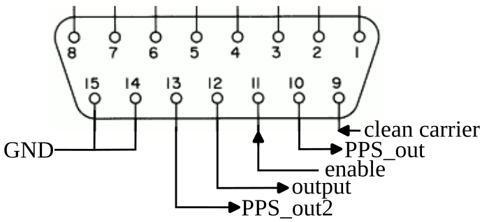

# X310 integration

The project so far has focused on generating a PRN generator and the
carrier signal using one FPGA, and recording the radiofrequency signal
for post-processing with an Ettus Research X310 SDR transceiver. The X310
FPGA however still has plenty of space left, so that the PRN generation 
gateware can be merged with the datastream handling functions provided by
Ettus Research. Since the two functions are running independently, the
Amaranth generate Verilog code is merged next to the original X310 software
and the resulting program is synthesized to produce a single bitstream.

## X310 bitstream generation

A patch is provided to modify X310 firmware:

```
git clone https://github.com/EttusResearch/uhd.git
cd uhd
git checkout VERSION -b VERSION
patch -p1 < /somewhere/amaranth_twstft/0002-VERSION-x310-add-twstft-amaranth.patch
```

`VERSION`  may be **v4.1.0.5**, **v4.3.0.0** or **v4.4.0.0**.

**Note**: *UHD* **v4.1.0.5** needs *Xilinx Vivado* version 2019.1.
*UHD* **v4.3.0.0** and **v4.4.0.0** needs *Xilinx Vivado* version 2021.1 +
[AR76780 patch](https://support.xilinx.com/s/article/76780?language=en_US)
(see [kb](https://files.ettus.com/manual/md_usrp3_build_instructions.html)).

```
cd fpga/usrp3/top/x300
source setupenv.sh
make X310_HG [TAPS=XXX] [NOISELEN=YYY] [INVERT_FIRST_CODE=1]
# to write bitstream into internal non volatile support
sudo uhd_image_loader --args "type=x300" --fpga-path build/usrp_x310_fpga_HG.bin
# or to load bitstream into memory (using JTAG / will be lost after a power cycle)
openFPGALoader -b usrpx310 build/usrp_x310_fpga_HG.bin
```

**Note:** `TAPS` `NOISELEN` and `BITLEN` are used to select a specific taps and to
configure PRN length before reinit. `INVERT_FIRST_CODE` is used to apply a xor
for the first code after PPS rise.

#### Pin functions

The input and output signals are available on the GPIO connector in front of the X310:



- reference PPS input and 10 MHz input to be connected to the corresponding SMA
behind the X310,
- fp_gpio  9 (Pin 11): enable
- fp_gpio 10 (Pin 12): output signal
- fp_gpio  8 (Pin 10): pps out (synchronized using ref clock)
- fp_gpio 11 (Pin 13): pps out2 (regenerated PPS using ref clock)
- fp_gpio  7 (Pin  9): force clean carrier output (no modulation)
- fp_gpio  6 (Pin  8): invert prn bit output
