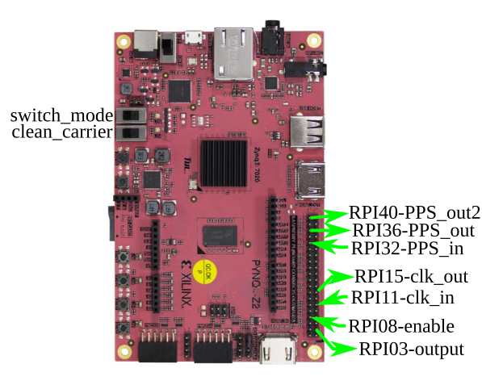
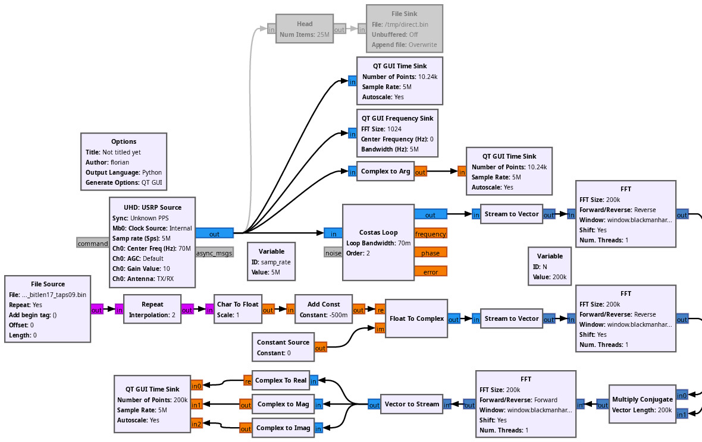

# PynqZ2 integration

## PynqZ2 bitstream generation

```
flashPynq_z2.py --bitlen=17 --noiselen=100000 --taps=9
```

## Pin functions

The input and output signals are available on the 40-pin Raspberry Pi compatible header:



## Signal processing using GNU Radio

The File Source on the bottmo left of the flow chart is assumed to hold the
pseudo-random sequence generated by the FPGA as provided by 
``./flashZedBoard.py -t T --noiselen L --bitlen B`` with ``T`` the tap index,
``L`` the length in chips and ``B`` the number of bits in the linear feedback
shift register. The resulting ``.bin`` file will hold one byte for each chip
equal to either 0 or 1, hence the subtraction of the mean value 0.5 before
correlating in the Fourie domain. Because the Fourier transforms might exceed
computational power for large ``L`` do not be concerned with Overflows in the
GNU Radio Companion console as the correlations might be missing a few samples
but will restart in the next data accumulation sequence.


