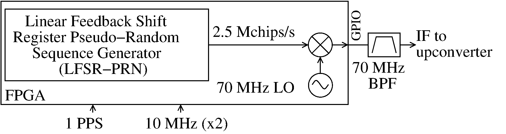

# Using Amaranth to implement TWSTFT Signal generation

*Two Way Satellite Time and Frequency Transfer* (TWSTFT) is a procedure that uses satellite communication to share a time and a frequency information in the form of a microwave phase-modulated carrier. As described in this [seminar](https://www.youtube.com/watch?v=9GlbMpPXi_A), spectrum spreading using a pseudo random sequence phase-modulating the carrier is used for spreading the spectrum and allows for recovering both time (and possibly frequency) on the receiver side. The input reference signals are assumed to be 10MHz and the rising edge of a 1-Pulse Per Second (1-PPS), the chip rate to be 2.5Mb/s and the output intermediate frequency 70 MHz.

The goal here is to implement the whole radiofrequency synthesis chain on an FPGA board.

To implement such communication, we will here make use a Python library [_Amaranth_](https://github.com/amaranth-lang/amaranth). This python package allows to describe an FPGA architecture with python idioms that make the task much easier than with other languages like Verilog or VHDL. This library gives us the possibility to manage signals and registers in a quite intuitive way. It also abstracts a lot of FPGA programming concepts that are not that interesting for us in the context of TWSTFT. 

While the practical implementation focuses on the Zeboard fitted with a Zynq7020 System on Chip, using Amaranth should make the system portable and aims at avoiding proprietary synthesis tools (Vivado for the Xilinx parts).

You may find additonal tutorials about the use of Amaranth in [this playlist](https://www.youtube.com/watch?v=b_n8l795CQI&list=PLCfH8xIFcsLlklxjWLaXC_TZ9BlF0FuI9&ab_channel=EuropeanGNURadioDays)
 and their associated slides [here](./EuGRD_tutorial/slides_nath) 
In this documentation, explanations behind the amaranth implementation of TWSTFT and the Amaranth source code associated are given :

0. [Installation guide for amaranth and cie](Doc/0_Installation.md):
if you never programmed on FPGA boards before, this may be useful for becoming familiar with the opensource toolchain used in this project.

1. [PRN generation](Doc/1_PRN.md):
Pseudo Random Noise (PRN) generation for spreading the spectrum as needed for accurate timing and differentiating the emitters (CDMA)

2. [Synchronizing PRN with a 1-PPS signal](Doc/2_Sync_PRN_1PPS.md):
making the noise repeat exactly every second to create our 1 Pulse Per Second (1-PPS) signal

3. [Carrier signal generation](Doc/3_Carrier_Generation.md):
creating the electromagnetic signal that will carry the information (intermediate frequency to be upconverted for a satellite link)

4. [Mixing Signals](Doc/4_Mixing_Signals.md):
mixing the carrier with our 1-PPS to share the frequency information

5. [Next level, QPSK modulation](Doc/5_another_modulation.md):
stepping up the PSK modulation to transmit twice as much information

6. [Demodulating the N-PSK modulated signal using GNU Radio](Doc/6_Demodulation.md):
steps needed to demodulate the phase-modulated signal using GNU Radio or GNU/Octave

7. [Quick description of the current version](Doc/AboutTheCurrentVersion.md)

