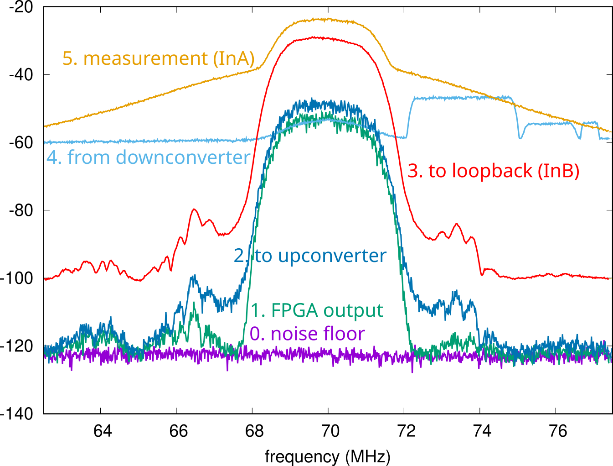

Spectra power measurements (1 kHz IF BW):

| Measurement step | power (dBm) |
|-------------|-------|
| FPGA output | -20.1 |
| Noise floor | -85.6 |
| to upconverter|   -15.9|
| to loopback channel (X310) | -7.9|
| from downconverter |  -21.0 |
| to measurement channel (X310) |  -9.7|

