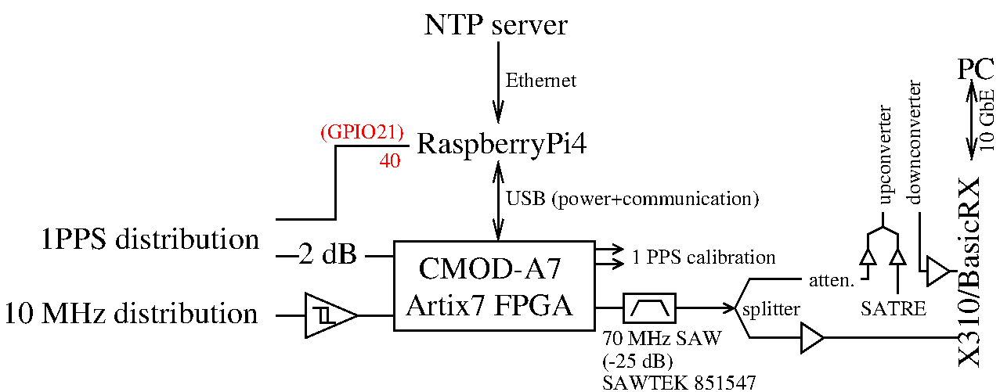

C++ data acquisition from two BasicRX fitted in an X310 connected by a 10 Gb
Ethernet interface. The associated crontab and data acquisition script (assumes
``/usr/bin/nice`` is suid root) provided as well to automate acquisition.

Broadcasting the signal is controlled by a Raspberry Pi4 triggered every second
with a 1-PPS input and NTP synchronized: the ``script_raspberryPi4.py`` script controls
the emission time and duration. 

Recording the X310 stream is performed through a 10 GbEthernet link to a PC storing on 
SSD: make sure to regularly
``sudo fstrim -v /data`` where ``/data/`` is the SSD mouting point and mount with
``lazytime,norelatime,noatime`` to reduce file access load. The data storage medium
is formatted as EXT2 filesystem to avoid journaling.
