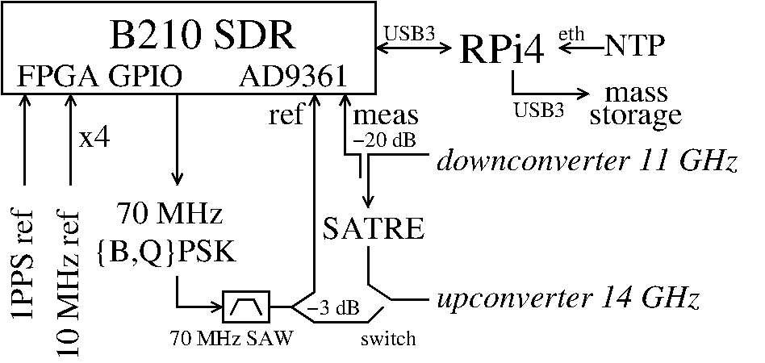
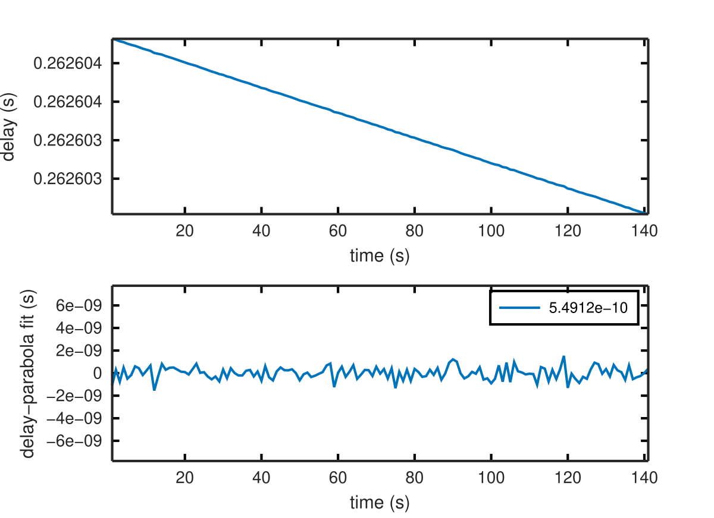
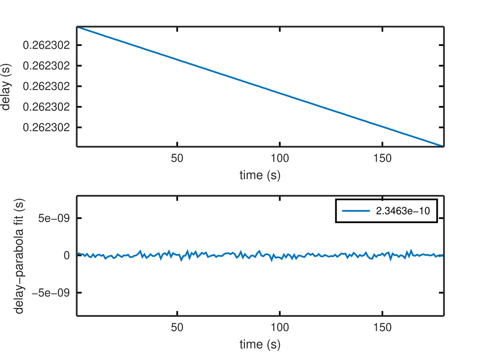

## Experimental setup:

## Results:

* LTFB_prn57bpsk22bits.bin: 2.5 Mchip long PRN code emitted from Besancon, 8 bit
integer (0 or 1)
* OP_prn22bpskcode0.bin: 2.5 Mchip long PRN code emitted from Paris, 8 bit
integer (0 or 1)
* godual_ranging_LTFB.m: script for ranging the Besancon signal
* godual_ranging_OP.m: script for ranging the Paris signal
* godual_txLTFB_rxOP.m: script for time of flight from Besancon to Paris
* godual_txOP_rxLTFB.m: script for time of flight from Paris to Besancon
* 11h45_OPranging.pdf: initial results of OP ranging
* 1657098900_LTFBranging.pdf: initial results of Besancon ranging

All these results are obtained *after* oversampling by 3, making the parabolic
fit of the correlation peak believe the sampling rate was 15 MHz (rather than the
actual 5 MHz) and getting rid of the fitting artifacts exhibited by (11h45_OPranging.pdf) 
and (1657098900_LTFBranging.pdf). From top to bottom: LTFB ranging, LTFB emission received
by OP, OP emission received by LTFB, OP ranging:

