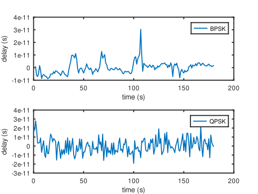

# BPSK vs QPSK modulation scheme

We initially (and mistakenly) envisioned that QPSK, by doubling the digital
datarate, would allow doubling the time resolution on the receiver side.
This assumption is mistaken because QPSK is two orthogonal BPSK streams:
whereas BPSK only communicate on the real (I) channel and keeps Q null,
wasting half of the bandwidth, QPSK makes best use of the whole bandwidth
but still the time resolution remains the inverse of the bandwidth, 
irrelevant on the digital datarate and spectral efficiency.

