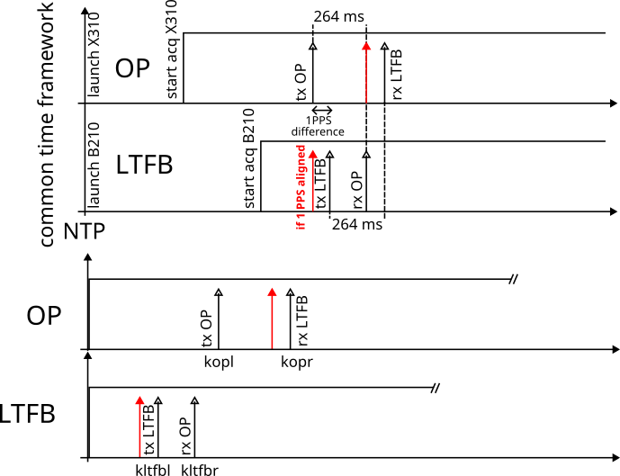

All binary records collected by the X310 (OP) and the B210 (LTFB) stored as interleaved short complex files were processed
using ``claudioltfbremote.m`` which aligns the local code to the decoded pattern and tracks the code offset while calculating
with 0.5 Hz accuracy the frequency offset in each 1-s long record. Each binary record is processed twice, once with the
local code for the loopback delay and once with the remode code for the one-way delay. The two-way processing is achieved
with 
```
tw=1/2*[remote1-local1-(remote2-local2)]
```

The challenge lies in aligning the two datasets recorded on both ends: while it is assumed that the emission starts
within the same second at both ends of the link synchronized by NTP, each SDR receiver starts at a random time
depending on the initialization duration of the X310 or the B210. Hence, in a common time frame (top of the picture below)
the NTP server synchronizes both ends of the link and each SDR receiver starts at its own time. However each SDR
record is referenced to its local timescale (bottom two charts) so that the signals must be aligned in the common timeframe
from the records starting at random time. This is aimed for in ``tw.m``



The current analysis
1/ provides a two-way analysis with no slope but with ``samp_rate/(2*Nint)/2`` jumps due to the alignement
processing. At the moment these jumps are manually removed (``2*Nint+1`` represents the interpolation and ``/2``
for the TW processing)
2/ this result, smoothed by a sliding average of 25 estimates (1-s long sliding average), exhibits a 300 ps standard
deviation ...
3/ ... but the mean value randomly fluctuates between a few ns and 10 ns.
