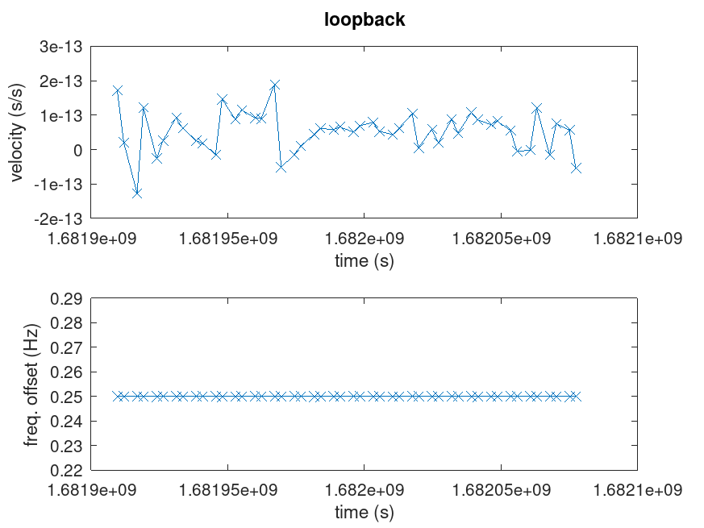
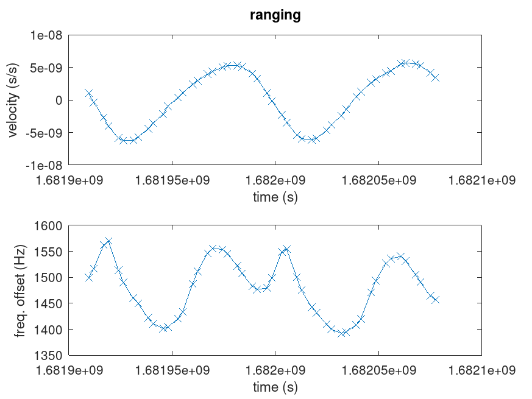
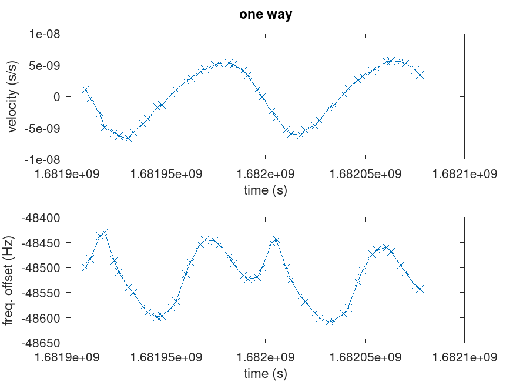

Loopback: notice the top chart is in 1e-13 s/s, defining the noise on the correlation time delay.

Ranging: code emitted from OP and received by OP. Top is the signal slope, bottom the frequency offset.

One-way: code emitted from LTFB and received by OP. Top is the signal slope, bottom the frequency offset.

See https://tf.nist.gov/general/pdf/2865.pdf for the impact of the Doppler and https://amostech.com/TechnicalPapers/2015/SSA/Decoto.pdf
for the identification of GEO satellite orbit correction.

At 14 GHz, the Doppler shift is, similar to RADAR where the wave frequency is both shifted when
incoming and outgoing $$df=2f_0\frac{v}{c}$$ Since each top chart is the relative motion $dt/t$ of the
satellite $v/c$, then the Doppler shift is $$df=2f_0\frac{dt}{t}\simeq 2\times 14\cdot 10^9\times 5\cdot 10^{-9}=140\mbox{~Hz}$$
