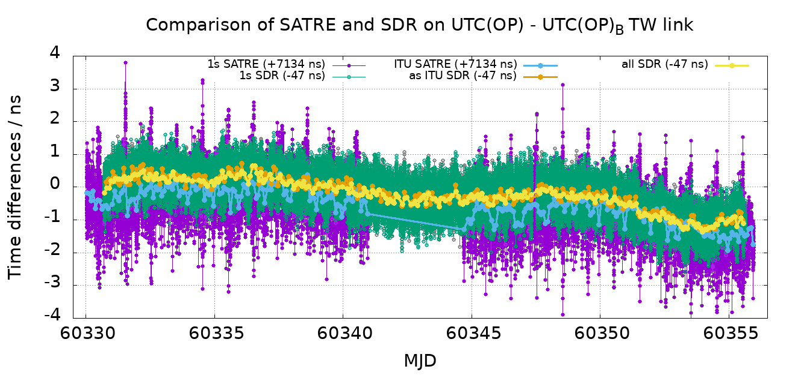
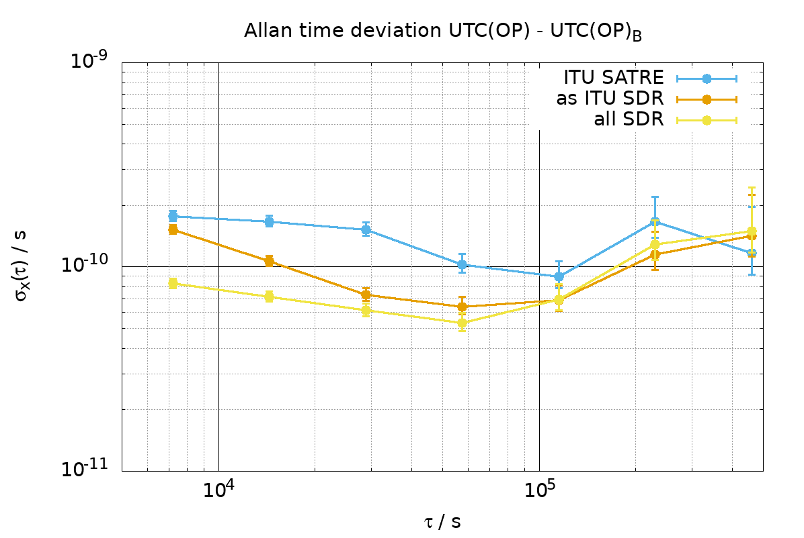
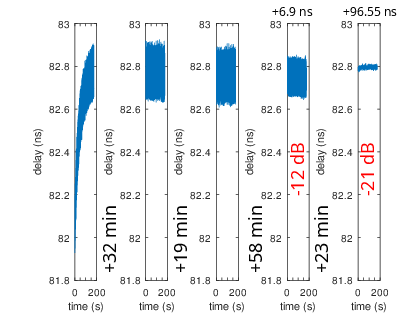

25-day long sessions between OP and LTFB using the NTP synchronized emission on both ends, with
a Raspberry Pi 4 actively monitoring the status of its real time clock and activating the ENAble
pin of the FPGA so that the code starts streaming at the next rising edge of the FPGA input 1 PPS.

All clocks -- driving the FPGA and the X310 -- are derived from the metrological sources, as are
the 1 PPS. The synchronization between both transmissions are now good enough for the reproducibility
from one session to another to be sub-ns.

Signal analysis courtesy of B. Chupin (SYRTE/Paris Observatory)

Two issues were identified at the end of this experient:
1. the 5 min sessions were started with the X310 streaming data a few seconds before the FPGA started
broadcasting the 70-MHz IF signal: it was later observed that the timestamps of the cross-correlation
output drifts by a few nanoseconds during the first minutes. If this drift is the same at both ends
it will compensate, but better to avoid it from the beginning by keeping the ADC active all time
(continuous acquisition and data streaming)
2. the gain on the loopback channel was too high, and despite the GNU Radio Time Sink not displaying
any saturation with signals in the +/-0.6 normalized value range, it was observed that including
attenuators on the loopback channel did not significantly decrese the amplitude until more than 12 dB
were included, and the standard deviation on the time delay within each run dramatically decreased whe
12 dB or even 21 dB attenuators were included with respect to the experimental setup used to achieve the
above results. Adding attenuators does include an additional delay unrelated to their geometrical length
and must be accounted for early in the final setup design.

