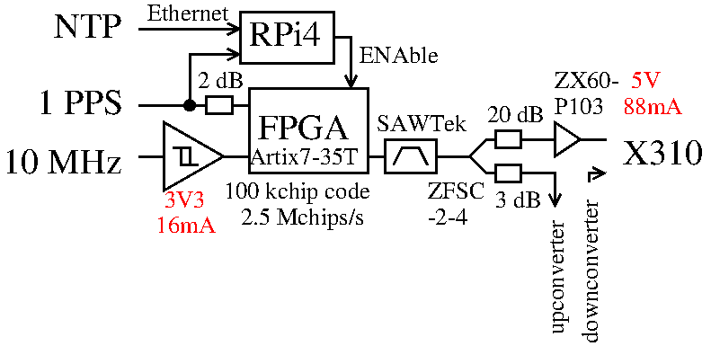

## January 2024: TX synchronized on 1-PPS

Experimental setup: the novelty is now to have the Raspberry Pi 4 synchronized
with NTP (hence the embedded Linux system and not a basic microcontroller) actively
monitor the 1-PPS input and trigger the FPGA enable signal during the second prior
to the start of the minute during which the communication must start: see
<a href="2401/rpi/getinterrupt.py">this Python script</a>. The 
<a href="https://digilent.com/reference/programmable-logic/cmod-a7/start">CMOD-A7 FPGA</a> 
is powered from the Raspberry Pi 4 USB bus and can be <a href="https://github.com/mvp/uhubctl">
powered off</a> remotely if behaving in unexpected ways (not used).

# Measurement results

Measurements are collected every odd UTC hour from minute 4 to minute 9 and 
minute 46 to 51 (5-minute long records). At the previous minute, the X310
SDR recording is started so as to collect data ~5 seconds (+/-2 s) prior to
the emission. Recording lasts 5.5 minutes to stop after the end of the emission.

<a href="go.m">Top</a>: Two-Way transfer resulting from the fine analysis of the correlation
peak of the difference of (transmitted-loopback) signals. Middle: standard
deviation on each transmitted signal record after removing the parabolic trend.
Bottom: velocity of the satellite as slope of the transmitted signal received
on the other side of the link.

<a href="goranging.m">Ranging</a> results from Besancon as coarse time delay between the 
transmitted signal and the loopback.

For comparison, the ranging measurement from Paris (OP) during 2023
as recorded at https://webtai.bipm.org/ftp/pub/tai/data/2023/time_transfer/twstft/op/
with a result consistent with the chart displayed above.

