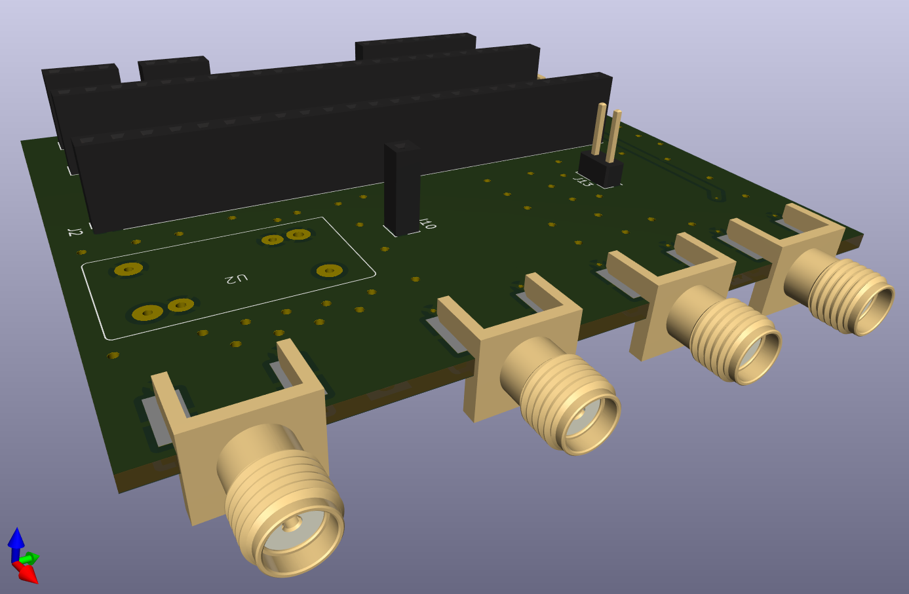
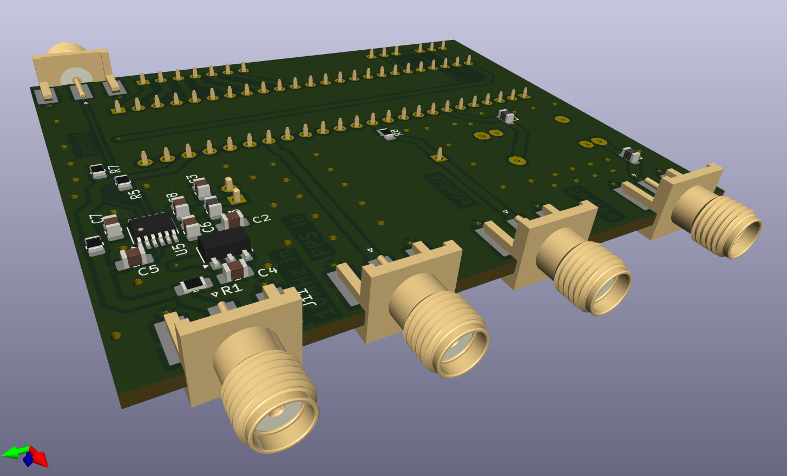
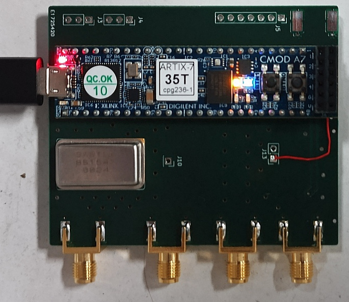
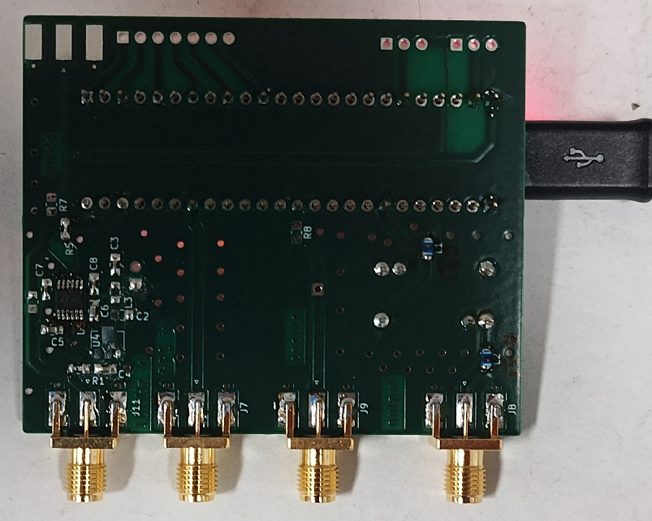

After <a href="https://github.com/oscimp/amaranth_twstft/blob/main/Doc/00_Installation.md">installing</a> ``amaranth_twstft`` and associated tools,
source Vivado's ``setting64.sh`` and run 
```
./amaranth_twstft/flashZedBoard.py --bitlen 17 --noiselen 1000000 --flash
```
where $\log_2(10^5)=16.6\leq 17$ leading to the selection of the 17-bit long GLFSR to generate the 100000 chip long PRN








